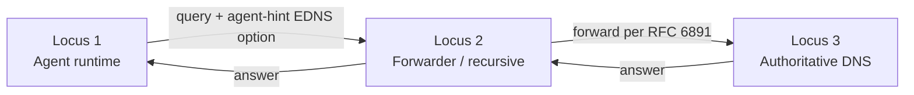

# Introduction

When you visit a website, DNS recursion gets cheaper the more your network has already seen the name. The first lookup from a cold cache walks the root, the TLD, the authoritative — three round trips, sometimes more if you're chasing CNAMEs. The second lookup, ten seconds later, is a single packet to your local recursive, who hands back the cached answer. The expensive part — finding *who* to ask — was paid by the network, not by you. That property is why DNS scales the way it does.

Agent discovery doesn't have this property yet. Today, an agent looking for another agent at a given domain walks a fixed sequence: query an index TXT, walk the named entries, fetch each agent's SVCB record, dereference the capability documents to filter. Every client repeats that walk, every time. There's no equivalent of "the resolver already knows the answer for you."

I [wrote earlier this year](https://www.darknetian.com/posts/2026-01-18-experimental-rr/) about a different angle on this problem — projecting agent metadata directly into a custom DNS resource record so clients can answer first-pass policy questions without an HTTP round-trip. That post called out a real constraint: DNS won't carry full multi-kilobyte agent cards even with EDNS(0), without running into fragmentation and operational pain. Right. That's still true. What I want to talk about today is the *other* place EDNS(0) earns its keep — not as a payload expander, but as a **signaling channel from the client toward the substrate**. Letting the client tell the resolver, at query time, *what kind of agent it's looking for* so any hint-aware hop on the path can narrow the result, serve a cached pre-filtered match, or short-circuit a search entirely.

This is the next experimental piece I'm exploring in [dns-aid-core](https://github.com/infobloxopen/dns-aid-core). The wire format, the reference implementation, the design rationale, the namespace conventions for keeping experimental work cleanly separated from the stable surface — all in review now. It sits alongside [DCV](https://www.darknetian.com/posts/2026-05-08-dns-aid-dcv/) (which merged Friday) in the broader [agentic AI discovery](https://www.darknetian.com/project/2026-01-17-ai-discovery/) story. DCV answered *can I trust this agent belongs to its domain*; this work goes after the question that comes first in practice — *which agent do I even want*, and how do you ask it without making every client re-run the same expensive walk.

It's forward-looking. There's no production deployment of a hint-aware resolver today. The goal of landing the wire format now is to give a target to the implementers who *will* build one.

<br>

## The Cost-Decay Model

Three states a client can be in for any given discovery:

- **Cold** — no caches anywhere on the path. The client falls back to a search provider or federated registry. Expensive. HTTP fan-out, multi-domain walks, the works.
- **Warm** — somewhere along the resolution path, a hop has a fresh matching record. No expensive search; possibly no DNS round trip at all if the hop is in-process.
- **Hot** — the client itself has already parsed and stored the SVCB record as a long-lived "skill." No query at all until the record is invalidated by a failed invoke or scheduled re-verification.

The hint is most useful at the **warm** state. At hot, it's bypassed. At cold, search is still the right answer. What the hint does is *make warm achievable* by letting whichever programmable hop along the path is hint-aware do the work of matching the client's intent against what the substrate has.

<br>

## Three Loci of Processing

The hint flows toward the authoritative. Any hop that understands it may act on it. Hops that don't simply forward it unchanged per RFC 6891.



- **Locus 1** is always usable — emits the hint + caches on the local resolver.
- **Locus 2** is optional — hint-aware only if the operator ships a recursive extension.
- **Locus 3** is optional — hint-aware only if the operator ships a custom DNS server (stock BIND is inert to the option).

Separately, the publisher advertises which selectors are meaningful for its agents via an `edns_signaling` block in the cap-doc / agent-card JSON the client already fetches. That advertisement tells the client *which selectors to populate* — orthogonal to whether any DNS-path hop is hint-aware.

**Locus 1** is anything in the client's address space — today, a small in-process `EdnsAwareResolver` that caches DNS answers keyed by hint signature. Long-term, this is where the SDK grows into a real agentic cache, or where a small DNS-like cache process colocated with the agent runtime fetches metadata out of band and serves warm answers locally. We always control this one.

**Locus 2** is a hint-aware recursive resolver or forwarder. Corporate gateway, ISP shared resolver, anything that's not the authoritative. Out of scope for the v0 reference implementation but explicitly in scope for the design — the wire format works for this hop without modification.

**Locus 3** is a hint-aware authoritative DNS server. Stock BIND, Route53, Cloudflare are inert to the option per RFC 6891. The design accommodates a hint-aware authoritative as a valid deployment shape — what shape that takes is an open conversation for the people building authoritative software.

<br>

## Two Axes of Selectors

The interesting design decision was sorting selectors into two structural categories with different cache semantics. The first draft of this option had four selectors — `capabilities`, `intent`, `transport`, `auth_type` — and during review I had to admit two of them were the wrong layer. SVCB doesn't carry capability strings; those live in cap-doc JSON that an authoritative server would have to dereference per-query to filter on. That's not work the substrate can do without breaking DNS latency budgets.

So the redesign split selectors along what data the authoritative actually has access to:

**Axis 1 — substrate filters (codes 0x01–0x0F).** Things any auth/cache can decide on without dereferencing anything. Participate in the cache key.

| Code | Name | Purpose |
|---|---|---|
| 0x01 | `realm` | Match SVCB `realm=` param — multi-tenant scope |
| 0x02 | `transport` | `mcp` / `a2a` / `https` — already encoded in `_{proto}._agents` |
| 0x03 | `policy_required` | Only records carrying a `policy=` URI |
| 0x04 | `min_trust` | `signed` / `dnssec` / `signed+dnssec` — gated on `sig` param + DNSSEC chain |
| 0x05 | `jurisdiction` | ISO region (`eu`, `us-east`) — compliance lever |

**Axis 2 — metering / lifecycle (codes 0x10–0x1F).** Things about the request itself. Drive policy applied to the request — rate limits, freshness budgets, fan-out signals, deadlines — but do *not* change what records get returned.

| Code | Name | Purpose |
|---|---|---|
| 0x10 | `client_intent_class` | `discovery` (browsing) vs `invocation` (about to call) |
| 0x11 | `max_age` | Cache freshness budget in seconds |
| 0x12 | `parallelism` | Expected sibling-query count — fan-out signal to caches |
| 0x13 | `deadline_ms` | Wait budget. Hint-only — DNS has no SLA-refuse semantic in v0 |

The structural payoff: `AgentHint.signature()` — the function that computes a cache key — includes Axis 1 only. Two queries that differ only in metering (`parallelism=4` vs `parallelism=64`) hit the same cache entry. They're asking for the same answer set, just with different request policy. Fragmenting the cache on metering would defeat the warm-state amortization the design is built around.

Capabilities and intent didn't disappear — they moved to the *Channel 1 JSON advertisement* (the `edns_signaling.honored_selectors` field on a publisher's cap-doc), where the client uses them for post-fetch local filtering. That's the right layer for them. The earlier post's [philosophy](https://www.darknetian.com/posts/2026-01-18-experimental-rr/#philosophy) of *projecting the same underlying metadata into multiple DNS-friendly representations* applies cleanly here: the cap doc is the rich JSON document, the SVCB params and DNS index are the substrate-friendly projection, and the EDNS hint is the *query-time selector over the projection*.

<br>

## A Worked Example: Async Fan-Out

The motivating use case for Axis 2 came from a real shape: a client running a multi-agent job — research, draft, review, format — dispatches four discoveries in parallel against different domains. Each sibling query shares lifecycle properties. Same wait budget. Same intent class. Same expected parallelism count.

Here's the wire payload one of those queries carries, captured live against the BIND9 testbed:

```text

$ tcpdump ... | grep -A 4 "SVCB?"
17:08:35.113080 eth0  Out IP 172.28.0.20.45162 > 172.28.0.10.53: 10625+ [1au] SVCB? _assistant._mcp._agents.orga.test. (109)
	0x0040:  0029 1000 0000 0000 002f ff96 002b 0006
	0x0050:  0104 7072 6f64 0203 6d63 7004 0673 6967
	0x0060:  6e65 6410 0a69 6e76 6f63 6174 696f 6e12
	0x0070:  0134 1305 3330 3030 30
```

Decoded:

- `0x0029 0x1000` — OPT pseudo-RR, type 41, 4096-byte UDP payload
- `0xff96 0x002b` — option-code 65430 (`agent-hint`), length 43
- `0x00 0x06` — version 0, 6 selectors follow
- `01 04 "prod"` — `realm=prod`
- `02 03 "mcp"` — `transport=mcp`
- `04 06 "signed"` — `min_trust=signed`
- `10 0a "invocation"` — `client_intent_class=invocation`
- `12 01 "4"` — `parallelism=4`
- `13 05 "30000"` — `deadline_ms=30000`

A hint-aware cache on the path can read this and:

- Pre-warm cap-doc fetches for any candidate matching `realm=prod & transport=mcp & min_trust=signed`
- Keep the cache entry warm long enough to satisfy the other three siblings (which will share the same signature because their Axis 1 values are identical)
- Skip rate-limit policy that would otherwise throttle a `discovery` burst, because `client_intent_class=invocation` says these are about to invoke

Stock BIND9, in the testbed, treats the option as inert and returns the same SVCB record it would have returned without the option. No response echo. That's the design's lowest-common-denominator deployment — the client-side cache at Locus 1 still gets value, but no upstream filtering happened.

<br>

## Self-Audit Against the DCV Review

This is the second piece of dns-aid-core work I've put up this month. [The first](https://www.darknetian.com/posts/2026-05-08-dns-aid-dcv/) — DCV — went through three security review passes before merging. The pattern that came out of that review was *every parser for DNS wire data needs to be fail-closed by default and tested adversarially*. I tried to bake that into the EDNS work from day one:

- **First-wins on duplicate selector codes.** A hostile forwarder appending an overriding selector (`realm=prod` ... `realm=evil`) gets the second occurrence dropped. Mirrors the same fix Igor flagged in DCV's TXT parsing.
- **Empty Axis-1 values decode to `None`, not empty string.** Matches the encode-side `if self.realm:` skip and prevents a forged empty-value payload from fragmenting the cache key under a value the legitimate client would never produce.
- **Truncated payloads, invalid UTF-8, garbage numerics → `ValueError`.** No silent fallthrough; no fail-open path.
- **The env-flag gate has its own test file.** 18 tests covering truthy/non-truthy values, exception-swallow (experimental crash must not propagate into stable core discovery), and contextvar reset scoping. The wire emission was the most security-relevant runtime gate; it gets the most adversarial coverage.

70 unit tests across the three new experimental files. Full unit suite 1569 passing. Wire verification confirmed bit-for-bit against the BIND9 testbed via `tcpdump`. The DCV review left me a checklist; the EDNS work was built against that checklist from the first commit.

<br>

## Tradeoffs Worth Naming

**No consumer ecosystem yet.** Nothing in production knows what `agent-hint` means. The wire format is in IANA's private-use range. Value accrues when a hint-aware programmable hop — at any of the three loci — ships. The reason to land the option now is to give an interop target to the implementers who *will* build one.

**Middlebox transparency is uncertain.** RFC 6891 says forwarders MUST propagate unknown options. In practice, many don't. The design is built to remain useful even when the option never leaves the client — Locus 1 (in-process cache) handles that case. Operators relying on Locus 2 or 3 should test their path with `tcpdump`.

**The hint leaks query intent.** Every hop along the path sees what the client is looking for — more than a bare SVCB query reveals. The privacy section of the design doc covers when clients should omit selectors and what scrubbing recommendations apply at the recursive boundary. Cookies and correlation IDs are reserved for future axes (codes 0x20+) but explicitly *not* coded in v0 — they add an identity dimension that should be specified separately.

**`deadline_ms` is hint-only.** DNS has no "refuse for SLA reasons" semantic. An auth can prefer a faster code path or serve a stale cache entry to meet the budget, but cannot return a "won't meet deadline" error in v0. A future revision could add a structured INFO-CODE in the OPT response (RFC 8914-style) for explicit SLA refusal; out of scope here.

<br>

## Where This Fits

DCV and this EDNS(0) work answer two different halves of one question. DCV is *can I trust who this agent says it is*; the hint is *which agent do I want, and can the network find it for me cheaply*. The [custom RR experiment](https://www.darknetian.com/posts/2026-01-18-experimental-rr/) explored what *answers* might look like inside DNS once you've decided DNS is the right substrate at all. All three are pieces of the same wager: an agentic web that resolves through the naming system everyone already runs, not five vendors' database rows you have to ask permission to be in.

The pieces I haven't shipped yet but are clearly next: a re-verification scheduler for directories using DCV at scale, and an HMAC-bound token model that removes per-issuance state. Each of those gets its own post when there's something concrete to point at. For now the wire formats are landed (or in review), the design docs are written in a shape that lifts cleanly into a future IETF draft when an LF spec home arrives, and the experimental namespace convention is in place so the next round of forward-looking work has somewhere to live.

If you want to read the design rationale in full, it's at `docs/experimental/edns-signaling.md` in the dns-aid-core repo. The wire format ABNF is alongside it.
