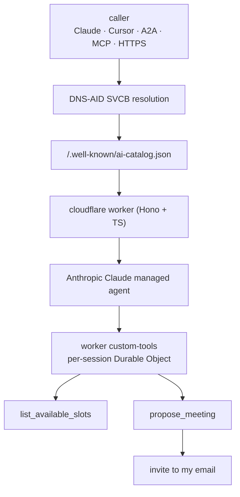

The [Five Fake Agents](/posts/2026-05-14-five-fake-agents-real-dns/) post six days ago published five DNS-AID records under `darknetian.com` pointing at fictional endpoints — `endpoint.darknetian.com` resolved to an RFC 1918 address that nothing in the universe will ever connect back to. The records were real. The agents weren't.

`bookings` is the first to grow up. As of today there's a real Cloudflare worker at `bookings.darknetian.com`, real Anthropic Claude Managed Agent behind it, real Google Calendar plumbing, real iCalendar `METHOD:REQUEST` emails landing in my inbox when someone asks for a meeting. The DNS-AID record didn't change. The ANS attestation didn't change. What changed is that the endpoint the SVCB points at now does something useful when you call it.

This is the post about how that's wired.

<br>

## The Picture

End-to-end flow from caller through Anthropic and back to a calendar invite:


- **DNS-AID** resolves bookings via SVCB; AliasMode → `bookings.darknetian.com`; ServiceMode pins endpoint + `alpn` + `bap` + `well-known` + `cap-sha256`.
- The catalog enumerates three protocol surfaces; the worker adapts protocol → unified prompt and hands it to Anthropic Claude.
- **`list_available_slots(date_range)`** reads N iCal feeds, inverts busy → free.
- **`propose_meeting(start, duration, requester_*, topic)`** sends an ICS `METHOD:REQUEST` via Resend.
- I stay the human in the loop.

Everything outside the Anthropic cloud runs in one worker. Everything inside is just an LLM with two custom tools registered. The boundary is deliberate — Anthropic's runtime is great at conversation and tool routing; my worker is the only thing that touches my calendar.

<br>

## The Three Surfaces, and Why

`bookings` advertises three protocol surfaces in its [ai-catalog](/posts/2026-05-16-ai-catalog/):

- **`/a2a`** — [A2A](https://a2aproject.dev/) JSON-RPC. For agent-to-agent callers that already speak A2A natively.
- **`/mcp`** — [MCP](https://modelcontextprotocol.io/) streamable-http. For Claude Code, Cursor, and any other IDE-style host that's expecting an MCP server.
- **`/ask`** — Plain HTTPS JSON, request/response. For curl, for debugging, for callers that just want to send a sentence and get a string back.

Three URLs, three protocol families, one logical agent. That's the [agent-card + ai-catalog](/posts/2026-05-13-agent-cards/) story playing out in production. The catalog enumerates the surfaces; each surface points at the same underlying Anthropic agent; each surface translates its native protocol into the same `messages[]` array before handing off. The agent doesn't know which protocol the caller used. It doesn't need to.

All three surfaces are live. The protocol plumbing — JSON-RPC envelope wrapping, MCP streamable-http chunking, capability negotiation — is mostly mechanical. The interesting part is the tools.

<br>

## The Tools — Outside the Agent's Context

Two custom tools run on the worker side, registered with the Anthropic agent. The agent decides *when* to call them; the worker decides *how*.

<br>

### list_available_slots(date_range)

The agent calls this when a user asks about availability. the worker:

- Pulls the published iCal feeds for every calendar I care about — Google Calendar's public ICS URL, Outlook publish URL, Apple iCloud public calendar. No OAuth, no credentials in the worker's environment, just public ICS feeds I've opted in to publishing.
- Parses each feed (RFC 5545 is wordy but parseable in a few hundred lines of TypeScript).
- Collects all busy intervals across feeds.
- Inverts them against the requested `date_range` to produce free intervals.
- Filters by my working hours, drops weekends, drops slots shorter than the agent's minimum (default 30 min).
- Returns the free intervals to the agent.

The agent never sees the raw calendar data. It sees free intervals. Keeping it there means I can rotate which calendars are published, change my working hours, change the slot minimum, all without touching the agent — but it also means the agent's view of "my schedule" is exactly as honest as my publishing settings. Forget to publish a calendar and it'll cheerfully offer a slot I'm already booked into; the only thing it knows about my time is whatever the tool decides to expose.

<br>

### propose_meeting(start, duration, requester_name, requester_email, topic)

When the agent has agreed on a slot with the caller, it calls this. the worker:

- Builds a [VEVENT](https://www.rfc-editor.org/rfc/rfc5545#section-3.6.1) with `METHOD:REQUEST`, organizer = me, attendees = me + requester.
- Wraps it in an iCalendar `VCALENDAR` envelope.
- Sends it via [Resend](https://resend.com/) as a multipart email with the ICS as both an attachment *and* an inline `text/calendar` body. Gmail and Apple Mail render the inline calendar attachment as an actionable "Accept / Decline / Maybe" widget.
- Returns confirmation to the agent.

I get the invite, I accept it like any other invite, my calendar updates. Crucially: **the agent does not write to any calendar.** No OAuth, no calendar.write scope, no agent-driven state changes to my schedule. The agent *proposes*; I *accept*. That's the line I'm not willing to cross: a strange agent talked to my agent and the worst it can do is put an email in front of me. The agent never gets to change my day without me clicking accept.

<br>

## Per-Session Durable Objects

Each conversation gets its own Durable Object. The DO holds:

- The session's message history (for protocol surfaces that need to thread context across turns)
- Cached iCal pulls (the feeds get fetched once per session, not once per tool call)
- Rate-limiting counters (so a single requester can't fan out a hundred propose_meetings)

Durable Objects are Cloudflare's primitive for "one consistent thing per key." Per-session state, no race conditions, no shared mutable global. the worker's request handler routes to the right DO, the DO handles tool invocations, and the agent in Anthropic's cloud sees a clean stateless interface.

<br>

## Discovery — Three Ways, All Consistent

When someone wants to find this agent, they can:

- **DNS-AID** — query `bookings._agents.darknetian.com` for SVCB. AliasMode points at the flat `bookings.darknetian.com`. ServiceMode SVCB there carries the well-known catalog URL and the integrity hash.
- **ANS** — query [ans.darknetian.com](https://ans.darknetian.com/) for the agents-index.json envelope. The bookings entry has its registration receipt, signed by the RA, committed to the transparency log.
- **Cloudflare canonical** — fetch `https://bookings.darknetian.com/.well-known/ai-catalog.json` directly if you already know the host.

All three return consistent answers because the same publishing script writes all three. The DNS-AID `cap-sha256` SvcParam matches the SHA-256 of the catalog body matches what ANS attests to in its event envelope. End-to-end integrity from `dig` through `curl` through `sha256sum`, signed by DNSSEC at the substrate and by the RA at the registry.

<br>

## How to Talk to It

Three ways, in order of how much protocol machinery you want in the way.

<br>

### Plain HTTPS — Just Send a Sentence

If you have curl and an opinion:
```bash

curl -X POST https://bookings.darknetian.com/ask \
  -H "content-type: application/json" \
  -d '{"q": "do you have a 30-minute slot next Tuesday afternoon?"}'
```

You'll get back a JSON object with the agent's reply. If the reply suggests slots, send the slot back the same way:
```bash

curl -X POST https://bookings.darknetian.com/ask \
  -H "content-type: application/json" \
  -d '{"q": "book the 2pm one. my name is Jane Doe, jane@example.com, topic is DNS-AID review."}'
```

Calendar invite lands in my inbox; I accept; you get it on your side.

<br>

### MCP — Point Claude Code, Cursor, or Any MCP Host at It

Drop this in the MCP server config of whatever you're using:
```json

{
  "mcpServers": {
    "darknetian-bookings": {
      "url": "https://bookings.darknetian.com/mcp"
    }
  }
}
```

Then ask the model in natural language — "use the bookings agent to find me a 30-minute slot next week." The MCP host discovers the tools (`list_available_slots`, `propose_meeting`), the model picks which to call, the worker does the calendar plumbing.

<br>

### A2A — Native Agent-to-Agent

If your planner already speaks A2A, point it at:
```text

https://bookings.darknetian.com/a2a
```

The planner's agent-discovery layer will pull the A2A AgentCard, register the capabilities (`scheduling`, `calendar`), and route requests to the right tool. No further config needed.

<br>

## The Takeaway

The agent-discovery story I've been writing about for the last week — DNS-AID for resolution, agent cards for description, ai-catalog for multi-protocol, AgentFinder for federation, DIDs for portable identity — is composable specifically because each layer does one thing. `bookings` exercises four of those layers in production right now.

It's also a useful proof that the open-web architecture works without registries, without lock-in, and without the agent vendor needing to know which protocol or which discovery method the caller will choose. The agent gets to be one thing. The substrate handles the rest.

Come book a meeting. The agent will figure it out.



Day-one operational telemetry from the Cloudflare dashboard — 340 worker invocations, 7 Anthropic-side sessions, $0.13 spent, 0 errors:



