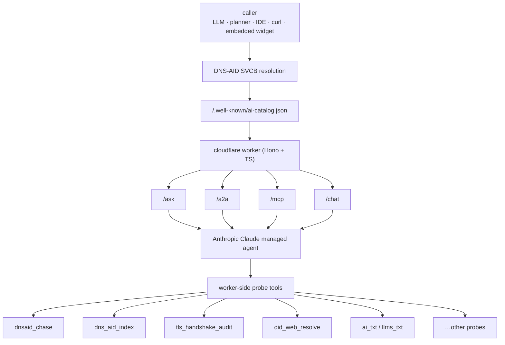

[Bookings Goes Real](/posts/2026-05-20-bookings-goes-real/) two days ago was about turning a fictional DNS-AID record into a working scheduling agent. Today is about the second one: `morpheus.darknetian.com` is the live DNS-AID *discovery auditor*. Same Cloudflare-worker + Anthropic-managed-Claude shape as bookings; entirely different job.

Where bookings is *transactional* (propose a slot, send a calendar invite) morpheus is *observational*, and it stays that way. Every probe it runs is a public read: a DoH lookup, an HTTPS GET, a TLS handshake. The agent's job is to walk an arbitrary domain's substrate from the outside and report what it finds. Nothing more.

The question it answers is the one agent operators actually need answered: **is my agent reachable by other agents?** Not "can my own toolchain reach it" as that's table stakes. The real question is whether a *foreign* agent, doing standard DNS-AID / AgentFinder / AI-Catalog discovery, will find your agent, follow the cap-doc URL, verify the hash, complete the TLS handshake against your TLSA pin, and end up at a working endpoint. Morpheus *is* that foreign agent. Loaded on `/agents/` and pointed at darknetian.com, it answers the same way it would for any other zone.

<br>

## The Liberator of Agents

The character Morpheus, in the film, asks Neo: *"What is real? How do you define real?"* The answer he wants is uncomfortable: real is what's *verifiable*, not what someone else tells you is real. In Plato's allegory of the cave, the figure who escapes the cave returns not to rule the others but to show them the chains they hadn't noticed. The Liberator role isn't authority, it's *clarity about what's actually there*.

That's the posture this agent takes toward other people's agent infrastructure. It walks the substrate underneath someone's claims (the SVCB records, the DNSSEC signatures, the TLSA pins, the cap-doc hashes) and tells you what's verifiable end-to-end from the public internet. Not what the marketing page says. Not what the registry vendor implies. What you can actually prove.

The deeper question morpheus is built around: **your right to be discovered on the internet should not depend on your relationship with a third party.** Not a registry. Not an app store. Not a cloud vendor's "AI agent catalog". Not whether your CTO has a working business relationship with whoever owns the index. Every one of those is a centralization point where someone *else* decides if your agent exists in the world's view. Pay your bill, agree to their terms, stay in their good graces, or you disappear.

DNS-AID's wager is that you already own the substrate that solves this. Your own DNS zone, signed with DNSSEC, with SVCB records pointing at content-hash-pinned cap-docs you serve from your own host. Federated by design, operator-owned by definition, integrity-protected by cryptography that nobody can revoke from you. Your name. Your trust chain. Your right to be found, derived from your right to own a domain — which, despite everything, remains the closest thing the internet has to a sovereign primitive.

That only works if someone independent can *verify it for you*, on demand, without writing anything back to your zone. Morpheus is that verifier. The audit is honest specifically because the agent walking your substrate has no interest in the outcome... it's not your registry, it's not your vendor, it's not selling you anything. It's a read-only set of probes following the standards you already publish. If your substrate is honest, it'll say so. If your substrate claims things that aren't there, it'll say that too.

That's the entire job. Liberator of agents, in the small, philosophically-coherent sense: helping you see whether the chains you didn't notice are still on.

<br>

## What It Walks

Five frontiers, sourced from proposals across the **IETF**, **UN ITU-T**, **AAIF**, and the other agentic-standards bodies currently arguing about how this should work. Each frontier has its own set of probes; each probe returns one or more *findings* — title, severity, body text, optional fix. The agent synthesises a score across all of them.

The frontiers:

- **Discovery substrate** — does the zone have a DNS-AID `_agents` namespace? Walkable AliasMode records pointing at canonical owners? An index leaf at `_index._agents.<zone>` advertising the agent map?
- **Identity attestation** — for each discovered agent: a SVCB ServiceMode at the canonical name? `well-known` SvcParam pointing at a cap-doc? `cap-sha256` matching the actual catalog body? TLSA at `_443._tcp.<agent>.<zone>` pinning the SPKI? A `did:web` resolvable from the agent host?
- **Operational** — is the agent host *reachable*? TLS handshake succeed? Does the catalog URL return 200 with the right content-type? Do the per-protocol cards parse?
- **Protocol maturity** — does the agent declare protocols matching what the SVCB advertises? Are the cards conformant to the agent-card spec? Is the ai-catalog wrapper present? Are AgentFinder `representativeQueries` set?
- **Crawler-readability** — does the zone publish `/llms.txt`? `/ai.txt`? Are there machine-readable `<link rel>` tags on relevant pages? Is the ANS attestation linkable?

Each frontier carries a weight in the final score:

```text

Completeness         40%   ← how much of the expected substrate is present
Trust                30%   ← DNSSEC, TLSA, integrity hashes, signatures
Operational          20%   ← does the thing actually answer
Protocol maturity    10%   ← are the format/spec conventions followed
                    ----
                    100%
```

Failures in the Trust frontier hurt more than failures in Protocol maturity, on purpose. A domain that publishes a beautifully-formatted catalog with no DNSSEC + no TLSA is *less* trust-anchored than one with a sparse catalog and a fully-signed chain.

<br>

## The Architecture

Same gateway shape as bookings, different surface count and a different streaming behavior:



- **DNS-AID SVCB resolution** — AliasMode → `morpheus.darknetian.com`; ServiceMode pins endpoint + `cap-sha256`.
- **`/.well-known/ai-catalog.json`** — enumerates four protocol surfaces; all four translate into the same `messages[]` array.
- Protocol surfaces: **`/ask`** (plain HTTPS JSON, one-shot) · **`/a2a`** (A2A JSON-RPC `message/send`) · **`/mcp`** (MCP Streamable HTTP) · **`/chat`** (SSE stream).
- Worker-side probe tools (the actual DNS / TLS / HTTP work):
  - **`dnsaid_chase`** — walk the `_agents` namespace, resolve every leaf
  - **`dns_aid_index`** — pull `_index._agents.<zone>` SVCB + TXT envelope
  - **`tls_handshake_audit`** — open a TLS connection, snapshot the cert + chain
  - **`did_web_resolve`** — fetch `/.well-known/did.json`, verify keys
  - **`ai_txt`** / **`llms_txt`** — fetch declared policy + agents listed
  - …other probes, per-frontier

The Claude side picks tools. The worker side runs the probes. Same separation-of-concerns as bookings... Anthropic's runtime never touches a DNS resolver or a TLS socket directly; it just decides *what to ask about* and *how to phrase the findings*.

<br>

## The Four Surfaces

Bookings has three protocol surfaces — `/ask`, `/a2a`, `/mcp`. Morpheus has four because audits are *streaming events*: per-probe findings arrive over seconds, not all-at-once. The natural fit for that is SSE, and SSE is what `/chat` does.

The four:

- **`/ask`** — HTTPS JSON, one-shot. Send `{message}`, get back `{reply, tool_calls, stop_reason, session_id}`. Good for "run an audit and give me the final score" type questions, less good for showing progress.
- **`/a2a`** — A2A JSON-RPC `message/send`. Same one-shot semantics as `/ask`, but wrapped in the A2A envelope so native A2A planners can register morpheus as a callable peer without protocol translation.
- **`/mcp`** — MCP Streamable HTTP. Implements the standard `initialize` / `tools/list` / `tools/call` triad with direct dispatch. Drop the URL into Claude Code / Cursor / any MCP host and ask "use morpheus to audit example.com" — the host discovers tools, picks one, hands it the domain.
- **`/chat`** — Server-Sent Events. Send `{message, session_id?}`, receive a stream of typed events: `session`, `text_delta`, `tool_use`, `probe_result`, `dcv_required`, `score`, `done`. This is the surface the embedded widget on `/agents/` uses, because watching findings appear one at a time is how an audit *should* feel.

All four resolve through the same Anthropic-managed Claude. The agent doesn't know which protocol the caller used — every surface translates into the same `messages[]` array before handoff. Adding a fifth surface tomorrow would be a router change in the worker, not an agent change.

<br>

## A Walk Through an Audit

Type `audit darknetian.com` into the chat on `/agents/`. The SSE stream looks roughly like this:
```text

event: session
data: {"session_id":"sesn_018F3xX9H66JBoV4FaTaiWo1"}

event: text_delta
data: {"delta":"Auditing darknetian.com. Walking the DNS-AID substrate first…"}

event: tool_use
data: {"name":"dns_aid_index","input":{"zone":"darknetian.com"}}

event: probe_result
data: {"probe":"dns_aid_index","result":{"findings":[
  {"sev":"pass","title":"_index._agents.darknetian.com SVCB present","body":"Resolved with DNSSEC AD flag set..."},
  {"sev":"pass","title":"_index._agents.darknetian.com TXT envelope parses","body":"agents=morpheus:mcp,a2a;bookings:mcp,a2a,https"}
]}}

event: tool_use
data: {"name":"dnsaid_chase","input":{"zone":"darknetian.com"}}

event: probe_result
data: {"probe":"dnsaid_chase","result":{"findings":[
  {"sev":"pass","title":"morpheus._agents.darknetian.com AliasMode → morpheus.darknetian.com","body":"..."},
  {"sev":"pass","title":"bookings._agents.darknetian.com AliasMode → bookings.darknetian.com","body":"..."},
  {"sev":"warn","title":"search._agents.darknetian.com AliasMode → search.darknetian.com but canonical owner has no live endpoint behind the ServiceMode","body":"..."}
]}}

event: tool_use
data: {"name":"tls_handshake_audit","input":{"host":"morpheus.darknetian.com"}}

event: probe_result
data: {"probe":"tls_handshake_audit","result":{"findings":[
  {"sev":"pass","title":"TLS 1.3 handshake completed","body":"Cipher: TLS_AES_256_GCM_SHA384..."},
  {"sev":"pass","title":"TLSA 3 1 1 matches SPKI fingerprint","body":"_443._tcp.morpheus.darknetian.com TLSA 3 1 1 33393d35... — matches live cert SPKI hash"}
]}}

… (more probes — did_web_resolve, ai_txt, llms_txt, agent_card_fetch, ai_catalog_parse, agentfinder_probe) …

event: score
data: {"headline":91,"sub_scores":{"completeness":38,"trust":29,"operational":18,"protocol_maturity":6},"detail_locked":false}

event: done
data: {}
```

(`detail_locked: false` because darknetian.com has been verified for this session via DCV `audit darknetian.com` from inside the darknetian.com origin auto-passes the challenge. For an unverified domain the same audit returns presence chips + counts and the bodies stay sealed.)

The widget renders this as: a typing text reply at the top, italic tool-use markers, collapsible per-finding cards (green ✓ for pass, amber ⚠ for warn, red ✗ for fail, gray ⨯ for error), and the gauge widget that fills in with the final score at the end. Each finding can have an optional `fix` field which renders as a cyan suggestion box inside the card — for warns and fails, what would close the gap.

The `dnsaid_chase` warn above is real for darknetian.com today: the search agent has both its walkable alias and a ServiceMode at the canonical name, but nothing actually answers at the endpoint (because search isn't a live agent yet). The audit catches the substrate-vs-liveness gap. The fix field reads:

```text

publish search.darknetian.com. SVCB 1 search.darknetian.com.
  alpn=h2
  bap=mcp
  port=443
  key65400=https://search.darknetian.com/.well-known/ai-catalog.json
  key65401=[sha256-of-catalog-body, base64url]

OR retract search._agents.darknetian.com if the agent isn't shipping.
```

Real BIND-shaped advice. Generated by the agent at audit time from whatever it observed.

<br>

## Public Summary, Detailed Remediation After You Prove Control

Reading public DNS is free, so morpheus runs the probes for any caller asking about any domain. The gate isn't on *probing*. It's on *what gets returned*.

Anyone can ask `audit microsoft.com` and morpheus will resolve everything it can publicly resolve: the index, the agent owners, the SVCBs, the TLSAs, the cap-docs, the cards, the DID Documents, etc. and return a **public summary**: the headline score, the four sub-scores, severity counts, and a one-word presence verdict per probe (`present` / `partial` / `missing` / `error`). Enough to tell you whether your substrate is recognisably present and roughly how trust-anchored it is. Nothing that hands you the *fix*.

What's gated behind DCV is the **per-finding detail**: the body text explaining what was wrong, the exact record name that's missing, the hash that didn't match, the BIND-shaped zone-file fragment that would close the gap, the code + reference URLs. That detail is a turn-by-turn remediation plan for a zone — and a third-party scanner handing that out about *someone else's* domain to anyone who asks is just a reconnaissance service with a nicer UI. So it's gated on proving you own the zone. The summary tells you whether you have a problem; the detail, only the operator should get.

The mechanism is **DCV**: Domain Control Validation via a TXT record at `_agents-challenge.<zone>`. The flow:

- Caller asks `audit microsoft.com` → morpheus probes everything, returns the summary
- Summary ends with `detail_locked: true` and a hint pointing at DCV
- If the caller is in fact Microsoft, they call `dcv_issue_challenge microsoft.com` → morpheus returns the TXT owner name plus the four-field body to publish: a fresh `token=` (base32, 20 bytes), `domain=microsoft.com`, `bnd-req=svc:morpheus@darknetian.com`, and `expiry=<RFC3339>`. Wire matches [draft-ietf-dnsop-domain-verification-techniques-12 §6.1.2](https://datatracker.ietf.org/doc/draft-ietf-dnsop-domain-verification-techniques/) — the `domain` field stops cross-zone replay, the `bnd-req` field stops another verifier from accepting your TXT, the `expiry` gives you a hard time-box
- They publish that TXT at `_agents-challenge.microsoft.com` (any zone-edit path: control panel, CI, manual, or the [DNS-AID SDK](https://github.com/infobloxopen/dns-aid-core) for fully-scripted automation)
- They call `dcv_verify_challenge microsoft.com` → morpheus walks every TXT at the owner, constant-time-compares the `token` field, validates `domain` and `bnd-req` match expectations, parses `expiry`, and confirms it's still in window. Six distinct failure modes — `token_not_found`, `expired`, `domain_mismatch`, `bnd_req_mismatch`, `malformed`, `doh_error` — get logged separately in the AE telemetry so it's clear *why* a verification failed
- On success: session marked verified for that domain. Caller calls `score_detail` → morpheus returns the same findings the summary rolled up, but with the bodies, codes, and remediation text included

The example flow, end to end:

```text

> audit microsoft.com

(public summary, free, anyone)
─────────────────────────────
domain:           microsoft.com
headline:         62 / 100
sub_scores:       completeness 24/40  trust 18/30  operational 14/20  protocol_maturity 6/10
findings_count:   { pass: 7, warn: 4, fail: 3, error: 0 }
presence:
  dns_aid_index     missing
  dnsaid_chase      partial
  tls_handshake     present
  did_web_resolve   missing
  ai_txt            missing
  llms_txt          present
  agent_card_fetch  partial
  ai_catalog_parse  missing
  agentfinder_probe error
detail_locked:    true
unlock_hint:      Per-finding bodies + ready-to-paste BIND fixes are
                  unlocked after DCV verifies you control microsoft.com.
                  Call dcv_issue_challenge to start.

> dcv_issue_challenge microsoft.com

publish this TXT and tell me when done. token is good for 30 minutes:

  _agents-challenge.microsoft.com.  IN  TXT  (
    "token=jvrxc3qe2pkz4axhn6t5wuy7boi5l4dm "
    "domain=microsoft.com "
    "bnd-req=svc:morpheus@darknetian.com "
    "expiry=2026-05-22T23:45:00Z"
  )

> (caller publishes the TXT, waits a minute for propagation)
> dcv_verify_challenge microsoft.com

✓ TXT resolved, DNSSEC AD set.
✓ token matched, constant-time.
✓ domain=microsoft.com matches.
✓ bnd-req=svc:morpheus@darknetian.com matches issuer.
✓ expiry 2026-05-22T23:45:00Z still in window.
  session verified for microsoft.com — detail unlocked for this turn.

> score_detail

(full findings, gated, only after DCV)
──────────────────────────────────────
findings:
  ✗ fail   ai_txt    /ai.txt missing
    Microsoft does not publish /ai.txt at the apex. Other crawlers
    have no machine-readable statement of training / citation policy.
    fix:  publish at https://microsoft.com/ai.txt with at minimum:
            User-agent: *
            Citation: encouraged
            Sitemap: https://microsoft.com/sitemap.xml
            LLM-Index: https://microsoft.com/llms.txt
    refs: spawning.ai/ai-txt
    code: AI_TXT_001

  ✗ fail   dns_aid_index    _index._agents.microsoft.com SVCB missing
    No path-2 organization index. Crawlers walking _agents.microsoft.com
    can't bootstrap discovery without one.
    fix:  publish at _index._agents.microsoft.com:
            SVCB 1 ans.microsoft.com.  alpn=h2 bap=https
                                       key65400=https://microsoft.com/.well-known/agents-index.json
                                       key65401=[sha256-of-agents-index.json]
    refs: draft-mozleywilliams-dnsop-dnsaid §4.3
    code: DNSAID_IDX_001

  … (full bodies + fixes for every finding) …
```

It's the same primitive [DCV in dns-aid-core](/posts/2026-05-08-dns-aid-dcv/) ships for agent-to-zone proofs, repurposed here for *unlock detail*. The detail stays gated. The operator gets specific, copy-paste-able guidance they can show their network team.

<br>

## The Embed on /agents/

The chat widget lives at the top of [`/agents/`](/agents/). Type `audit example.com` (substituting your own domain) and watch the agent walk that zone's substrate live — the same SVCB / TLSA / catalog the looking-glass cards below are displaying for darknetian.com.

The framing matters: this isn't a sandbox demo against a fixed target. It's a working public auditor that happens to also audit *this* site if you point it that way. Anyone landing on `/agents/` can run their own zone through it in 30 seconds and watch the findings stream in. Public summary for any domain; full detail unlocks once you prove control via DCV.

If darknetian.com itself ever drifts from reality — a stale hash, a missing TLSA, a planned agent claiming to be live... morpheus will say so, independently. The looking-glass is descriptive; morpheus is operational; they're both pointed at the same zone. The audit is honest because they're independent.

<br>

## Discovery — Three Ways, All Consistent

Same triplet as bookings:

- **DNS-AID** — `dig SVCB morpheus._agents.darknetian.com` (the walkable alias) or `dig SVCB morpheus.darknetian.com` (the canonical). The flat-name SVCB carries `alpn=h2`, `bap=mcp,a2a` (key65402), `key65400=https://morpheus.darknetian.com/.well-known/ai-catalog.json`, `key65401=<cap-sha256 of catalog body>`. The cap-sha256 changes only when the catalog changes.
- **ANS** — [`ans.darknetian.com/v1/agents/6ccfd06b-b852-4c0e-afac-80d3048d9709`](https://ans.darknetian.com/v1/agents/6ccfd06b-b852-4c0e-afac-80d3048d9709) returns the signed badge, SCITT receipt, and event-history audit trail. The agent was committed to the transparency log at tree-size 2 (bookings was 1).
- **Cloudflare canonical** — fetch [`https://morpheus.darknetian.com/.well-known/ai-catalog.json`](https://morpheus.darknetian.com/.well-known/ai-catalog.json) directly if you already know the host. The SHA-256 of that body matches the `cap-sha256` SvcParam matches what ANS attests to.

The same publish script writes the manifest entry in [`darknetian-ans`](https://github.com/nicknacnic/darknetian-ans) and the worker config in [`darknetian-morpheus`](https://github.com/nicknacnic/darknetian-morpheus). If they ever diverge (eg the catalog changes without the manifest re-pinning) the looking-glass `DNS-AID + hash` pill flips to `× hash mismatch` and an auditor (including morpheus itself) catches the drift on the next walk.

<br>

## How to Talk to It

Four surfaces, four ways to call. The protocol-surface pills at the top of `/agents/` carry copy-paste-ready snippets — hover any pill and click `COPY`. Reproduced here:

**HTTPS** — fire-and-forget one-shot:
```bash

curl -sX POST https://morpheus.darknetian.com/ask \
  -H "content-type: application/json" \
  -d '{"message":"audit darknetian.com"}'
```

**A2A** — JSON-RPC for native A2A planners:
```bash

curl -sX POST https://morpheus.darknetian.com/a2a \
  -H "content-type: application/json" \
  -d '{"jsonrpc":"2.0","id":1,"method":"message/send","params":{"message":"audit darknetian.com"}}'
```

**MCP** — drop the URL into your IDE's MCP host config:
```json

{
  "mcpServers": {
    "darknetian-morpheus": {
      "url": "https://morpheus.darknetian.com/mcp"
    }
  }
}
```

**SSE** — same protocol the embedded widget uses, watch findings stream in live:
```bash

curl -sN -X POST https://morpheus.darknetian.com/chat \
  -H "content-type: application/json" \
  -d '{"message":"audit darknetian.com"}'
```

All four resolve to the same agent. The protocol surface is just the wrapping.

<br>

## The Takeaway

The arc of the last two weeks: agent-cards as identity format, ai-catalog as multi-protocol wrapper, AgentFinder as the federation layer, DNS-AID as the wire layer underneath all of them, ANS as the transparency log that vouches for what got published. Plus the [Five Fake Agents](/posts/2026-05-14-five-fake-agents-real-dns/) demo proving the substrate publishes cleanly without any actual agents behind it.

Morpheus is the agent that closes the loop: the one that *measures* whether all those layers are present, signed, and pointing at the same thing. Two live agents now. The other three (`search`, `threat-intel`, `dns-audit`) are next, in some order.

Point it at your own domain and you'll likely get a number lower than you expected — most zones are missing half the substrate they assume is there, and the audit doesn't soften that. That's the use of it: the score is only worth anything because it's willing to tell you that you're not as discoverable as you thought, and then hand you the exact records that would fix it.
