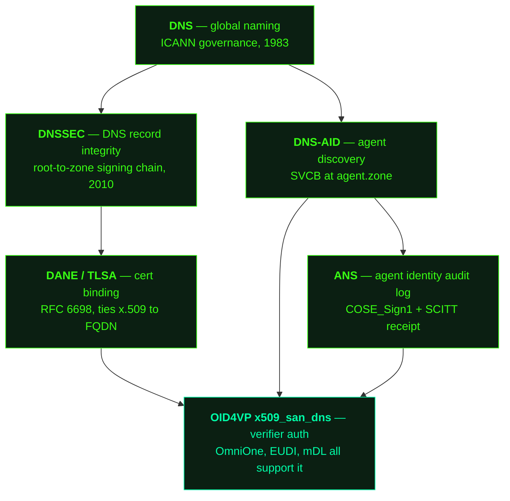
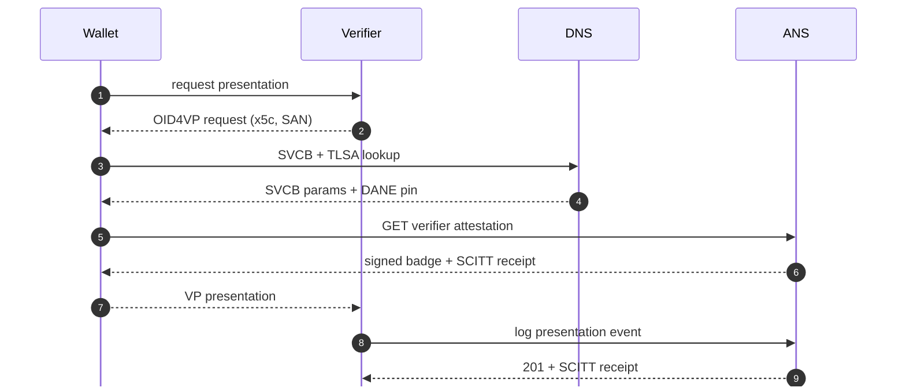

I checked in for a flight last week with my phone. My Apple wallet pulled a mobile driver's licence onto the screen, the airline accepted it as primary identification, and the TSA reader at the front of the queue lit green when I tapped. I never took the physical card out of my wallet. No third party stood between the issuer of the credential (in this case, Colorado DMV) and the verifier (TSA) checking it. 

I want my software to be able to do that.

Not "act as me" in some uncanny anthropomorphic sense — I mean a pharmacy-delivery agent (maybe even a drone!) that needs to prove that it's authorised to pick up a controlled prescription on my behalf, with all the same properties that made the airport tap work: an identity the verifier can check without phoning the issuer, a credential that discloses only what *this* transaction needs, a record on both sides that the exchange happened, and no third-party catalog standing in the middle taking rent on the relationship. None of that infrastructure exists for agents today. Most agent-to-agent calls authenticate on a hostname and a bearer token and call it good. The asymmetry — between what a phone can prove to TSA and what one agent can prove to another — is wider than it should be, and the reason it's wider has more to do with what hasn't been *named* in the agent world than with the underlying primitives being missing.

The interesting question is whether the mobile-wallet substrate — the chain of standards underneath that TSA tap — composes for agents. Mostly yes. Partly with a thin layer of new wire-format glue. And, importantly, without inventing any new authority for the agent layer to register with. That's the post. 

To understand why, it helps to know what's actually underneath the tap. I went looking in OpenDID's verifier code expecting nothing, the way you go looking for sock matches in a dryer — Republic of Korea open-sourced the full backend of their mobile-ID stack, and the question I was trying to answer was how the wallet identifies the *verifier* before disclosing anything. The answer was three letters: SAN. The OID4VP `x509_san_dns` client-id scheme binds the verifier's identity to a **DNS name** in the certificate's Subject Alternative Name extension. The wallet validates the request's certificate chain, matches the SAN against the configured verifier name, and only then unlocks disclosure. The trust anchor is the domain.

The same scheme shows up in France's mobile driver's licence implementation under ISO/IEC 18013-7, in the EUDI Wallet reference code, and in the US state-level mDL pilots. The convergence is what makes the post worth writing: the substrate that turns out to be load-bearing for agentic identity already exists, deployed, governed, signed, and paid for. The interesting work is naming what's there clearly enough that the agent layer can pick it up.

<br>

## Why an Agent Needs an Identity at All

An agent is a process that calls other agents. That's the whole shape of the agent ecosystem in 2026 — the bookings agent talks to the payments agent, the payments agent talks to the fraud agent, the fraud agent talks to a security-operations agent that opens a ticket and pages a human. Every hop is a network call where one party makes a claim ("I'm the bookings agent") and the other party has to decide whether to trust it.

The honest version of that decision today is: not very much, and not for very good reasons. The receiving agent looks at the source IP, maybe a bearer token, maybe a hostname in the TLS certificate. None of those answer the question that actually matters, which is *which agent, operated by whom, took this action, and can anyone prove it later*. A hostname proves the *channel* arrived from somewhere with a valid cert. A bearer token proves the caller has a string. Neither proves the caller *is* the bookings agent rather than something that has read access to bookings's secret store, or a process running on the bookings host but not the bookings binary, or a partner integration that overstepped its scope yesterday and has been quietly overstepping ever since.

The hostname-only model also rots under operations. Certs rotate. DNS records move. The host that served the response yesterday isn't necessarily the host serving it today. The hostname is a name; it isn't an actor and it isn't a record of what the actor did. As soon as the population of agents gets larger than a single operator can mentally model, the deficit shows up as the everyday failures of distributed trust — a misconfigured proxy that lets the wrong agent past the gate, a quietly extended scope on a long-lived token, an audit trail that says "an agent called this endpoint" but can't tell you which one.

Agents need identity for the same reasons humans do, with one important difference. The reasons are the ordinary ones: authentication ("are you who you say you are?"), authorisation ("are you allowed to do this?"), accountability ("can we prove later that you did it?"), and reputation ("should the next caller treat your signature as worth the bytes?"). The difference is that an agent's identity has to be checkable by *another process* on the wire, at scale, with no human in the loop, in milliseconds. That rules out a lot of the answers that work for humans — no flashing the badge, no notarisation, no relying on the verifier remembering you.

What's left is cryptographic identity. A keypair the agent controls, a name the keypair binds to, a record of that binding somewhere durable, and a way for any other agent to check the binding without phoning home to whoever issued it. The interesting question isn't *whether* agents need that; the question is *what carries the binding* and *what records the history*.

<br>

## Why Tie Cryptographic Proof to an Audit Log

If you accept that the agent needs an identity, the next question is what to do with it. There are two reasonable answers, and the right one is "both."

The first thing an identity does is **authenticate the live call**. The agent signs a request, the verifier checks the signature against a key associated with the agent's name, and the check either passes or it doesn't. This is the bit a TLS-style trust model can almost reach — if the cert SAN binds to the agent's name, and the channel is TLS, then the verifier knows the *channel* came from the named entity. Almost. It still doesn't know whether the named entity is the one acting, or whether the actor is what the name's operator intended to ship today.

The second thing an identity does is **make the history of actions checkable after the fact**. This is the part TLS doesn't do at all. TLS leaves no trace of what happened on the wire that anyone can prove later. If the bookings agent invoked the payments agent at 14:02 to release a hold worth $480, there's nothing — outside the operators' own private logs, which can be rewritten — that lets a third party confirm the call happened, who initiated it, or in what order it sat relative to the rest of the day's events. Disputes between operators bottom out at "trust my logs." Disputes with regulators bottom out the same way.

A transparency log fixes this by making the act itself a public, ordered, signed claim that the actor can't repudiate and the verifier can re-derive. The ANS transparency log is an append-only Merkle tree; every event added gets a SCITT receipt that anchors it to a specific tree state. The agent operator signs the event with their own key. The log signs the receipt with its key. The two signatures are independent — even if one of them is compromised later, the other still witnessed what the first claimed at the time. Anyone holding a receipt can re-derive the leaf hash from the event payload and prove the event is in the tree at the size the receipt named. Anyone watching the tree's published heads can detect a fork or a rewrite. The log doesn't trust the operator, the operator doesn't trust the log, and the verifier doesn't have to trust either — the cryptography binds them.

This is what *cryptographic proof to an audit log* buys an agent ecosystem that TLS alone doesn't. Authentication of the live call, accountability for the historical record, and a reputation signal that's a function of behaviour rather than a function of who paid which catalog to be listed. Once that's available as a primitive, an agent's identity is no longer a hostname someone hopes is right — it's a name that signs, a binding the world can check, and a log of acts that the operator can't quietly edit.

The remaining question is where the *binding* itself lives. That's the substrate question.

<br>

## The Substrate Question Agents Inherit

The serious wallet-identity proposals on the table all assume something agents don't have.

**TPM-rooted** assumes a hardware Trusted Platform Module attesting that a key lives in physical silicon that has never been extracted. That works for laptops and phones. Agents are processes; the silicon underneath is shared infrastructure. A TPM attestation about "the host running this agent" doesn't bind to "this agent under this operator's name."

**Wallet-rooted** assumes a mobile device with a sovereign-issued wallet — the EU's EUDI Wallet, the ROK's `DID-CA` mobile apps, the US mDL stack on iOS/Android. Agents don't carry phones. The wallet model presumes a human in the loop holding the device.

**Ledger-rooted** assumes every consumer can resolve a DID against a ledger — Hyperledger Besu, Fabric, Algorand, Bitcoin, KERI. OpenDID's verifier-server runs a Local Storage Service on port 8098 specifically to cache resolved DID Docs because round-tripping to the ledger on every verification is too slow. The infrastructure cost of running a resolver fleet is non-trivial and gets paid by the consumer, not the issuer.

None of those compose with agents at scale. What agents *do* have is a domain. A name that's already governed by ICANN, signed by DNSSEC, capable of carrying a cert whose SAN already binds the operator to the name. That substrate has existed since 1983, has been signed since 2010, and gets a new DNSSEC algorithm registration every few years. Every agent operator already pays for it.

The thesis: agent identity should not need a new authority. The substrate is the operator's domain. The wire format is the cert SAN. The integrity is DNSSEC. The discovery is DNS-AID. The audit log is ANS. The credential-issuance and verification ceremonies are the OID4VC / OID4VP flows that the wallet world has already standardised, with `x509_san_dns` as the binding to DNS.

<br>

## Why the European Model Doesn't Ship in the US

Before the technical argument, the political one — because the substrate choice is not neutral and pretending it is gets the work shelved.

eIDAS 2.0, in force since 2024, obliges every EU member state to issue a sovereign **Personal Identification Document** — a PID — into every citizen's EUDI Wallet. The PID carries given name, family name, date of birth, place of birth, nationality, and a stable identifier. It is the canonical assertion that this person is this person, signed by the state. Other credentials (driver's licence, diploma, banking onboarding, age proof) are issued *on top* of the PID by relying on the state's signature as the trust root. The wallet is mandated to be available to every citizen by 2026; the PID is the gravitational centre the rest of the credential ecosystem orbits.

That model is continuous with how European identity has worked for a century. A national identity card is unremarkable in France, Germany, Spain. Children get one. Adults carry one. The state is the issuer of personhood-for-paperwork-purposes and nobody flinches.

The same model in the United States is politically dead on arrival. The Real ID Act's twenty-year fight to even *standardise* state driver's licences for federal-building access still hasn't fully concluded; a federally-issued universal identity document for every citizen is the kind of proposal that draws coalitions from the ACLU on one side to libertarian state legislatures on the other. The "papers please" framing is so culturally loaded that the US mobile-DL effort — which *is* state-issued, by definition, because driving is state-regulated — explicitly engineered around it. ISO/IEC 18013-7 mandates selective disclosure (a bar verifier sees `over-21=true`, not date of birth) and unlinkability (the same credential presented twice doesn't trivially correlate to the same holder). The cultural pressure shaped the wire format.

Agent identity inherits all of this. Propose a federal agent-issuance authority in the US and the proposal does not survive its first hearing. Propose a private consortium and the antitrust posture is awkward and the governance is everyone's problem. Propose a ledger-rooted federation and now you're asking every consumer to either run a node or trust whoever runs the cache fleet. The EU's substrate works because Europeans have already accepted that the state issues identity; the US's substrate has to work *without* that acceptance, and the rest of the world watching this contest is going to pick whichever model doesn't require a new sovereign to trust.

DNS is the only universal substrate that isn't sovereign. ICANN is a multi-stakeholder body. The DNSSEC root-key ceremony is attended by named individuals from four continents who rotate quarterly under public protocol. No state has the keys; no company has the keys; the keys exist in HSMs in two physically separated facilities and require a quorum from a geographically distributed group to use. Whatever you think about that as a governance model, it is *visibly not a state* — and that distinction is what makes it the substrate the agent ecosystem can adopt without re-running the eIDAS political fight in every other jurisdiction.

This is why the neutrality argument is operational and not rhetorical. The point isn't that DNS-AID is *better* than the EUDI Wallet; for Europeans the EUDI Wallet is probably the right answer. The point is that DNS-AID is *adoptable in places where EUDI is not*, without forcing those places to first import the politics that make EUDI work.

<br>

## What Republic of Korea Actually Shipped

The OmniOneID project ([github.com/OmniOneID](https://github.com/OmniOneID), Apache-2.0) is the open-source backend of ROK's mobile driver's licence. The full backend is 18 repositories, ~454 MB shallow-cloned, all Java/Spring on the server side with mobile SDKs in Swift/Kotlin/Java. The relevant pieces for this argument:

- **`did-ta-server`** — Trust Anchor service. Owns the chain of authority for the federation.
- **`did-issuer-server`** — Credential issuance. Talks to wallets via OID4VCI.
- **`did-verifier-server`** — Verifier backend. Presents requests via OID4VP, validates presentations.
- **`did-ca-server`** — Certificate authority + attestation backend. Issues the certs the chain rests on.
- **`did-wallet-server`** — Server-side wallet for hosted scenarios.
- **`did-blockchain-sdk-server`** — Interface to Hyperledger Besu / Fabric / the underlying ledger.
- **`poc-oid4vc`** — Proof-of-concept OID4VC / OID4VP integration. **This is where the SAN binding lives.**

The DID method is `did:omn:`, ledger-anchored via Besu or Fabric. Resolution requires either running an LSS (Local Storage Service) cache or talking to the ledger directly. Credential format is W3C VC; presentation is OID4VP.

The interesting move is in `poc-oid4vc/source/servers/verifier-server`. When a wallet receives a presentation request, the wallet has to authenticate the *verifier* before exposing any credential. The OID4VP spec allows several client-id schemes for this; `x509_san_dns` is one. It says: the verifier's request object is signed by an x.509 cert whose SAN contains the verifier's DNS name. The wallet validates the cert chain to a WebPKI root, matches the SAN against the configured verifier DNS name, and only then unlocks the credential disclosure.

That's a verifier identity flow that bottoms out at DNS + WebPKI. No ledger lookup. No federation enrollment. No sovereign issuer. The OmniOneID code accepts it as a first-class scheme. So does the EU's EUDI Wallet reference implementation. So does the US mDL stack via ISO/IEC 18013-7.

ROK presented this at ITU-T's Trustable Digital Identities workshop in June. France presented an aligned mDL implementation. The convergence isn't accidental — `x509_san_dns` is the lowest-friction way to authenticate a verifier across jurisdictions that don't share a sovereign trust authority.

<br>

## What That Means for DNS-AID and ANS

DNS-AID already publishes an agent's canonical FQDN as an SVCB record, points at the agent's capability descriptor via `well-known`, pins the descriptor's content hash via `cap-sha256`, names the agent protocol via `bap`, and ties the endpoint to DANE-pinned x.509 certs via TLSA at `_443._tcp.<agent>.<zone>`. ANS V2 logs the registration as a SCITT-receipt-anchored event in an append-only transparency log and serves the agent's signed attestation at `/v2/ans/agents/<id>`.

What's missing is the wire format for the agent to act as an **issuer or verifier of W3C VCs / OID4VC credentials**, with the DNS substrate doing the trust-anchoring work that OpenDID does with `did-ta-server`.

The shape of the addition is small. A handful of new SvcParamKeys on the agent's existing SVCB record carry the binding metadata. A few SDK helpers thread that metadata through the OID4VP / OID4VCI flows the wallet ecosystem already uses. A new event type on the audit log captures issuance and presentation acts. None of it is novel cryptography — every primitive involved is shipped, deployed, and standardised. The work is the wire format that lets the layers fit together cleanly.

<br>

### Four New SvcParamKeys

These extend the existing DNS-AID record at `<agent>.<zone>`. Numeric code points land at the next available private-use slots (65410 onward, matching the experimental-module convention).

<table>
  <colgroup>
    <col style="width: 9rem">
    <col style="width: 22rem">
    <col>
  </colgroup>
  <thead>
    <tr><th>Key</th><th>Carries</th><th>Role</th></tr>
  </thead>
  <tbody>
    <tr>
      <td style="white-space: nowrap"><code>did</code></td>
      <td>DID URI, e.g. <code>did:omn:4EFNaYeA9hDp…</code></td>
      <td>Optional bridge from substrate-agnostic DNS name to ledger-rooted DID if the operator chose one. Lets a consumer verify both the DNS chain and the ledger chain, or pick whichever they trust.</td>
    </tr>
    <tr>
      <td style="white-space: nowrap"><code>x509-san</code></td>
      <td>Scheme marker / version</td>
      <td>Signals OID4VP <code>x509_san_dns</code> support. Lets a wallet validate the verifier's request object against the DNS name + cert chain.</td>
    </tr>
    <tr>
      <td style="white-space: nowrap"><code>vc-issuer</code></td>
      <td>URL of <code>/.well-known/openid-credential-issuer</code></td>
      <td>Closes the OID4VC discovery gap. Wallets that have only a QR-code-encoded credential offer can now resolve the issuer's metadata from DNS.</td>
    </tr>
    <tr>
      <td style="white-space: nowrap"><code>vc-schema</code></td>
      <td>URL or URN of the credential schema this agent issues against</td>
      <td>Schema portability. Optional; only meaningful for issuer-typed agents.</td>
    </tr>
  </tbody>
</table>

Each lands in `src/dns_aid/experimental/identity.py` for parsing and emission, and threads through `to_svcb_record()` into the existing `SvcbRecord` shape. The `core/` API surface stays unchanged.

<br>

### Three SDK Helpers

These are the runtime primitives. `verify_oid4vp_request` is the single highest-value addition — it wires DNS-AID directly into the OID4VP trust flow.

1. **`resolve_did(did)`** — given a `did:omn:…` (or any DID), discovers the operator's resolver endpoint via DNS-AID itself: an SVCB at `did-resolver._agents.<zone>` advertising the resolver. Proxies the resolution through the operator's resolver instead of every consumer running its own ledger client. Sidesteps the LSS-on-port-8098 problem OpenDID hits.
2. **`verify_oid4vp_request(request_jwt, expected_fqdn)`** — given an OID4VP signed request object using `x509_san_dns`, validates the `x5c` chain's SAN against `expected_fqdn`, then corroborates against the FQDN's DNS-AID record and DANE/TLSA pin. The result is a verifier whose identity has been checked at the WebPKI layer, the DNS layer, and the operator-published-substrate layer in one call.
3. **`fetch_vc_issuer_metadata(fqdn)`** — resolves DNS-AID record → reads `vc-issuer` SvcParamKey → fetches and parses the `.well-known/openid-credential-issuer` JSON. Standard OID4VCI metadata discovery rooted in DNS.

<br>

### What ANS Carries

ANS's job is the audit log. The COSE_Sign1 attestation envelope at `/v2/ans/agents/<id>` already carries the agent's signed badge plus a SCITT receipt anchoring it to the transparency log. The minimal addition is **a new attestation event type for credential issuance** — when an agent issues a VC to a holder, ANS logs the issuance event with the credential hash, schema URI, holder pseudonym, and timestamp. The log becomes the agent-side equivalent of OpenDID's Trust Anchor's audit trail, but rooted in DNSSEC + entity-signing rather than the operator's ledger.

A sketch of the event envelope shape, lifting from the sandbox's existing event format:

```json

{
  "$schema": "ans://v1.event.credential-issuance",
  "agentId": "6ccfd06b-b852-4c0e-afac-80d3048d9709",
  "fqdn": "issuer.darknetian.com",
  "eventType": "VC_ISSUED",
  "issuedAt": "2026-06-03T17:42:08Z",
  "credential": {
    "schema": "urn:opendid:vc:mdl:v1",
    "hash": "sha256:e8b4fc4d…",
    "holderPseudonym": "0xa1b2c3…",
    "format": "vc+sd-jwt"
  },
  "scittReceipt": "<COSE_Sign1>"
}
```

Three properties matter. **One:** the credential hash is what's logged, not the credential body — a consumer can verify a presented credential against the log without the log ever seeing the holder's claim data. **Two:** the SCITT receipt anchors the event to the TL's Merkle state, so an issuer can prove the credential existed at a specific tree size. **Three:** the entity signature on the inner event uses the agent's own key — DNSSEC vouches for the SVCB that says "this key belongs to this agent," the entity signature vouches for the event itself, and the TL vouches for the ordering. Three independent trust mechanisms over the same artifact.

<br>

## How This Is Different From What Already Exists

The substrate is layered. Each piece does exactly one thing, anchored in the layer below.



The boundaries:

| Layer | Owns | Doesn't own |
|---|---|---|
| **DNSSEC** | Integrity of DNS records along the root-to-zone chain | Trust in the operator above the zone (TLD, registrar). Why DNS-AID layers entity-signing on top. |
| **DANE / TLSA** | Pinning the x.509 cert to the FQDN; identifying the cert under DNS-anchored trust | Whether the cert chain validates under WebPKI; whether the cert was issued legitimately by the CA. |
| **DNS-AID** | Discovery — where the agent is, what it serves, what its capability descriptor pins to | Issuance or verification of credentials about the agent or by the agent. |
| **ANS** | Audit log of agent lifecycle events — registration, attestation, revocation, credential issuance | The credential body itself (hash only, never plaintext claim). Verifier policy. |
| **OID4VP `x509_san_dns`** | Authenticating the verifier to the wallet via DNS + cert SAN | Anything about the agent's discovery, capability, or audit history. |
| **OpenDID `did-ta-server`** | Trust anchoring for a ledger-rooted federation (analogue of what DNSSEC + DANE do for DNS-rooted) | Discovery, capability descriptors, federation outside the ledger. |

The two are not competing layers; they cover the same trust-anchor function at different scales. OpenDID's chain runs through a Trust Anchor server, an issuer-CA hierarchy, and a ledger to bind a DID to a verification key. DNS-AID + DANE + ANS run the same function through DNSSEC, the WebPKI cert chain, and the TL's append-only log. The credential issuance and verification on top — OID4VCI and OID4VP — are identical in both worlds. The substrate underneath is what differs.

The practical consequence: an agent operator who runs DNSSEC, has a WebPKI cert with the agent FQDN in its SAN, and publishes a DNS-AID + ANS record can act as an OID4VC issuer or OID4VP verifier without onboarding to anyone's federation. The wallet validates `x509_san_dns` against the cert. The cert chains to a WebPKI root. The DNS chain validates under DNSSEC. The ANS log proves the issuance happened. Five trust anchors in different layers, all already deployed, none requiring the operator to register with a new authority.

<br>

## What the Exchange Looks Like

To know the substrate works, you have to watch two agents actually use it. A local lab runs end-to-end on a single machine in about fifteen seconds, with no network dependency and no production credentials. It models an organisation, `example.com`, that operates two real agents — a *bookings* agent that watches reservation patterns and reports anomalies, and a *morpheus* agent that triages incidents into the security operations queue. Each agent registers with the organisation's transparency log on startup, receives a signed attestation it can hand out at request time, and gates inbound calls on the validity of the caller's attestation. A third agent, *rogue*, is registered the same way but is not on morpheus's guest list.

The point of the walkthrough is not to demonstrate that signatures work. The point is to show what each layer actually rejects and how cleanly the rejection localises.

### Use Case A — A Partner Agent Calls In and Is Accepted

Bookings detects a fraudulent reservation pattern and posts an incident report to morpheus. The request carries a pointer to bookings's own attestation. Morpheus fetches the attestation, validates the outer COSE_Sign1 signature against the producer key from the org's key registry, validates the embedded transparency-log receipt against the log's published verifier key, re-derives the leaf hash from the event payload, and confirms the leaf is in the log at the size the receipt claims. Five separate things just got checked, none of them transitively. Morpheus consults its policy — the `sub` on the attestation is `bookings.example.com`, which is in the guest list — and accepts the report. The response back to bookings includes the trust chain morpheus relied on: who the caller said it was, who issued the attestation, which key signed it, which leaf in the log it sits at. Bookings (or a human reading the log) can re-run every check.

That last property is what an audit log is *for*. The acceptance isn't recorded as "morpheus chose to trust bookings"; it's recorded as a sequence of checks any third party can repeat. Reputation in this model is what falls out of a clean history of those checks succeeding.

### Use Case B — A Caller Forgets to Attach Identity

A second agent — *rogue* in our lab, but in the real world it's just as likely to be a misconfigured legitimate process — sends a request to morpheus with no attestation pointer at all. Morpheus rejects at the very first gate, before any cryptography runs. The rejection is `401`, the reason is "no identity supplied," and the failure is recorded against whatever IP address actually opened the connection — not against any agent identity, because none was claimed. This is the trivial case but it's the one most production systems get wrong: they accept the call because the TLS terminated cleanly and the rest of the trust evaluation never had to fail because it never had to run.

### Use Case C — A Real, Valid Agent Calls In and Is Rejected Anyway

This is the case worth pausing on. Rogue presents *its own* attestation — a real, currently-active, cryptographically valid one signed by the same registration authority that signed bookings's. Every signature verifies. The transparency-log receipt is in the tree. The leaf hash is correct. The attestation is *not forged in any sense*. And morpheus still rejects, with a `403`, because the `sub` on the attestation is `rogue.example.com` and rogue is not in morpheus's guest list.

This separation is the part of the model that's easy to miss until you see it. Authentication is *cryptography* — it answers "did the caller actually sign this, and is the signing chain intact." Authorisation is *policy* — it answers "is this caller, even authenticated, allowed to do the thing they're trying to do." A trust substrate that conflates the two ends up either accepting too much (anyone who can sign anything) or rejecting too much (anyone not pre-shared a token). Splitting them lets the operator say "I will accept calls from anyone with a valid attestation under example.com" *and* "but only this specific agent is allowed at this specific endpoint" in two separate sentences, evaluated at two separate layers, with two separate failure modes the audit log can distinguish.

### What the Substrate Carried, Abstractly

The whole exchange ran on three primitives, all of which are pre-existing standards: an SVCB record that names the agent and points at its attestation, a COSE_Sign1 envelope that signs the attestation, and a transparency-log receipt that anchors the attestation event into an append-only Merkle log. No DID resolver was contacted. No federation was enrolled in. No catalog was queried. The agent's identity lived in DNS, the binding to a public key lived in WebPKI through the cert's SAN, the act of issuing the attestation lived in the log, and the receipt the log returned travelled with the attestation so any verifier could re-derive the proof. Five independent trust anchors, all already deployed somewhere on every operator's existing infrastructure, all already paid for.

<br>

### Shape of the Flow Once OID4VP Rides on Top



Reading the flow from top to bottom: the wallet asks the verifier for its presentation request and gets back an OID4VP signed request carrying an `x5c` cert chain whose SAN names the verifier's DNS identity. The wallet resolves that name in DNS to pull the SVCB parameters and the DANE/TLSA cert pin, then validates locally — `x5c` chains to a WebPKI root, the SAN matches the verifier's name, and the cert matches the DANE pin. The wallet then fetches the verifier's signed attestation from ANS along with the SCITT receipt proving inclusion in the transparency log. At that point the verifier's identity has been corroborated across four independent layers — WebPKI, DNSSEC, DANE, and ANS — and the wallet discloses the credential. The verifier logs the presentation event so the exchange is on the record on both sides.

Three independent trust anchors get checked before the wallet discloses the credential. WebPKI validates the cert chain. DNS-AID + DNSSEC validate the substrate. ANS validates the operator's audit history. None of those layers know about each other. The verifier can be compromised in any single layer and the other two still hold.

The negative cases in the sandbox already exercise this — when the imposter agent presents an attestation that's valid but for the wrong `sub`, the verifier rejects at the allow-list layer. When the attestation URL is unreachable, the COSE_Sign1 fetch fails. When the header is missing, the request is `401` before anything else runs. Each rejection is from a different layer; the trust chain is checked exhaustively, not transitively.

<br>

## The Neutrality Argument Made Operational

The three big identity proposals on the international table all introduce an intermediary. Centralised national roots route through whichever entity runs the root. Federated wallet stacks route through sovereign issuers and a hardware-bound wallet on every citizen's device. Ledger-rooted DID stacks route through whoever operates the ledger, plus whoever operates the caches every consumer has to query to make resolution affordable. Each model is internally coherent. Each requires a new governance authority that someone has to agree to trust as a precondition for anything else working.

DNS doesn't. DNS is governed by ICANN through a multi-stakeholder process; signed by DNSSEC under a root-key ceremony attended by named individuals from four continents who rotate under public protocol; resolved by every operating system shipped in the last quarter-century. Treating it as the substrate for agent identity is not a *new* trust assumption — it's the trust assumption every other system on the internet has already made and is already paying for.

The neutrality argument lands because it doesn't ask anyone to trust a new actor. It doesn't propose a new registry. It doesn't propose a new federation operator. It doesn't propose a new sovereign issuer. It proposes that the layer that already exists is sufficient, and that the work the agent ecosystem actually needs sits at the wire format on top — a verifier authentication scheme that already ships in OID4VP, a small number of SVCB parameters that say where to find the attestation, and a transparency-log event type for the acts an operator wants checkable later. None of that is anyone's territory to defend.

That's the part of the model that travels. A jurisdiction with strong sovereign-identity traditions can layer EUDI on top of it without losing anything. A jurisdiction with weak ones can adopt the substrate without having to import the politics. An operator can run the whole thing on infrastructure they already own without paying rent to anyone whose business model depends on continuing to charge them for the privilege of being discovered.

<br>

## The Art of the Possible

Agents will keep talking to other agents. The volume will go up by orders of magnitude. The number of operators participating will stop being countable on one keyboard. And the question every receiving agent has to answer — *who is this caller, signed by whom, doing what, on whose authority, with what record* — is going to be answered correctly or it's going to be answered wrong, and getting it wrong at scale is what produces the failure modes nobody wants to be on the wrong end of.

The substrate this post is arguing for already exists. DNS names the agent. DNSSEC signs the record. WebPKI binds a public key to the name through the cert SAN. A transparency log records the agent's acts and emits receipts that prove the record can't be rewritten later. OID4VP's `x509_san_dns` scheme already lets a wallet authenticate the verifier against that name. Every primitive in that sentence ships in software people are already running.

What remains is the wire format that lets the layers find each other — a small set of SVCB parameters so a consumer can resolve "agent" to "attestation pointer" without having to be told the URL out of band, an event envelope so an operator can record an issuance or a presentation against their own transparency log, and the integration code that makes those primitives feel like one system instead of five.

The art of the possible is that none of this is a research program. The cryptography is decades old. The DNS substrate is older than the web. The audit-log discipline is borrowed wholesale from Certificate Transparency, which has been running at internet scale since 2013. The convergence happening right now in OmniOneID, EUDI Wallet, and the US mDL pilots all chose `x509_san_dns` for the same reason — it's the lowest-friction way to authenticate across jurisdictions that don't share a sovereign trust root, and it points at the substrate every operator already maintains.

Agentic identity, anchored cryptographically in the primitives we already have, is one of the rare standards opportunities where the work is *naming* rather than *inventing*. The agents that need it will use it. The operators that publish it will be discoverable on their own terms. And the rest of the ecosystem will stop having to invent a new authority every time a new agent needs to prove it is who it says it is.

Your name. Your trust chain. Your acts on the record. Anchored in the substrate the internet already runs on.
